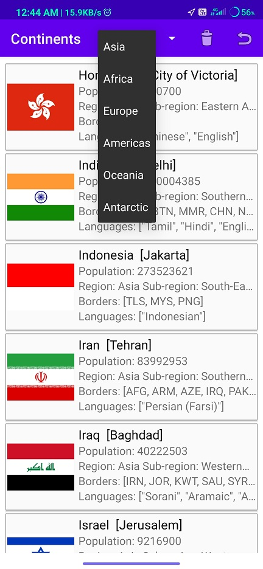

# CountryBook
This Country Book Application shows the countries' details based on the Continent selected.
You can select the continent from the drop down menu.
All the latest technology is used to build this app.
Used Room Database, Live Data, Glide library, Kotlin coroutines, Retrofit API etc.
Click link to download APK :  https://github.com/MayankChowdhary/CountryBook/tree/master/APK

<table style="width:100%">
  <tr>
     <td>
</td>
    <td>
</td>
    <td>
</td>
    
    
</tr>
</table>
